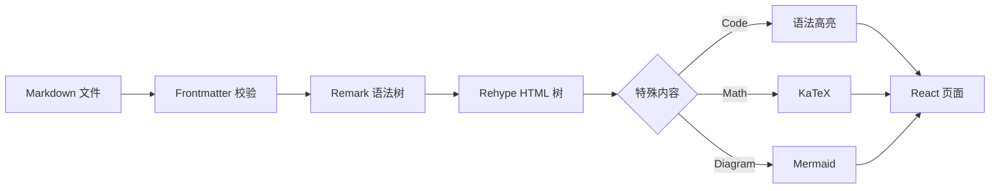

博客的内容系统看起来很简单：读取 Markdown，然后渲染页面。但当语法高亮、数学公式、图表和标题目录同时存在时，它已经是一条真正的内容处理管线。

如果其中某一步失败，而页面只显示“解析错误”，定位问题会非常困难。让每个阶段都能被观察，远比在最后一层捕获所有异常更有效。

## 内容经过的阶段



流程图揭示了一个容易忽略的事实：代码、公式和 Mermaid 并不是同一种节点。如果只在最终 HTML 上用字符串替换，很容易误伤其他内容。结构化语法树更适合完成这种转换。

## 在入口处校验

Frontmatter 是内容进入系统的第一道边界。标题或日期缺失时，应该在读取文件时立刻给出明确错误，而不是等到文章列表排序时才出现 `undefined`。

```ts
const PostSchema = z.object({
  title: z.string().min(1),
  date: z.string().regex(/^\d{4}-\d{2}-\d{2}$/),
  excerpt: z.string().min(1),
  tags: z.array(z.string()).default([]),
});
```

校验带来的价值不仅是类型安全，也包括更短的故障路径。错误离源头越近，修复成本越低。

## 记录能够回答问题的指标

不是所有数字都有价值。一条内容管线至少应该能回答下面几个问题：

| 问题 | 可记录的信号 |
| --- | --- |
| 哪个文件失败了？ | 文件名与 slug |
| 失败发生在哪一阶段？ | parser、transformer、renderer |
| 是否只影响特殊语法？ | 节点类型与语言标识 |
| 最近是否突然变慢？ | 各阶段耗时 |
| 问题是否能够复现？ | 输入摘要与依赖版本 |

若一次渲染总耗时为 $T$，可以把它拆成多个阶段：

$$
T = T_{read} + T_{parse} + T_{transform} + T_{render}
$$

总耗时只能告诉我们“变慢了”，分阶段耗时才能告诉我们“哪里变慢了”。

## 失败策略也属于设计

不同内容应该采用不同的降级方式。文章标题无法解析时，页面不应该继续渲染；一张 Mermaid 图失败时，则可以保留原始代码并提示图表未生成。

> 好的降级不是隐藏错误，而是在保留主要任务的同时，让问题仍然可见、可定位。

可以把失败分成三类：

1. **阻断型错误**：元数据无效、文章文件不存在；
2. **局部错误**：单个图表或代码块无法处理；
3. **装饰性错误**：非必要动画或外部统计数据不可用。

这种分类会直接影响错误边界的位置。若所有异常都由页面最外层处理，一个局部图表错误也会让整篇文章消失。

## 从测试文章开始

建立一组固定的测试文章，是保护内容管线最便宜的方法。测试集应包含长标题、中英文混排、代码、表格、公式、图表，以及没有描述的边界情况。

每次修改 Markdown 插件或文章样式后，先浏览这组内容，就能快速发现标题锚点偏移、暗色代码不可读、表格溢出等问题。它不替代自动化测试，但能让视觉回归变得具体。
