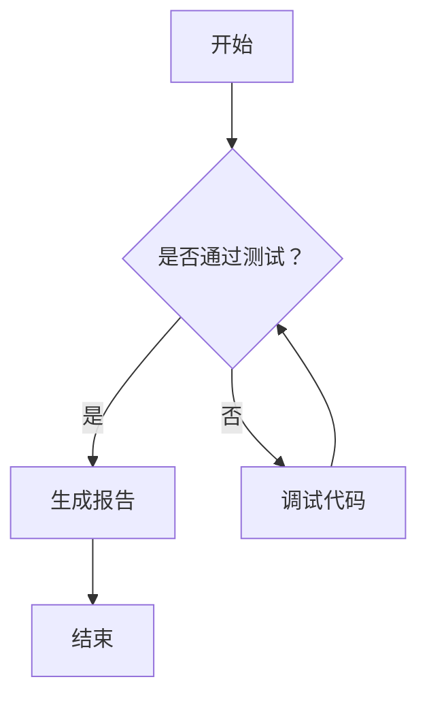
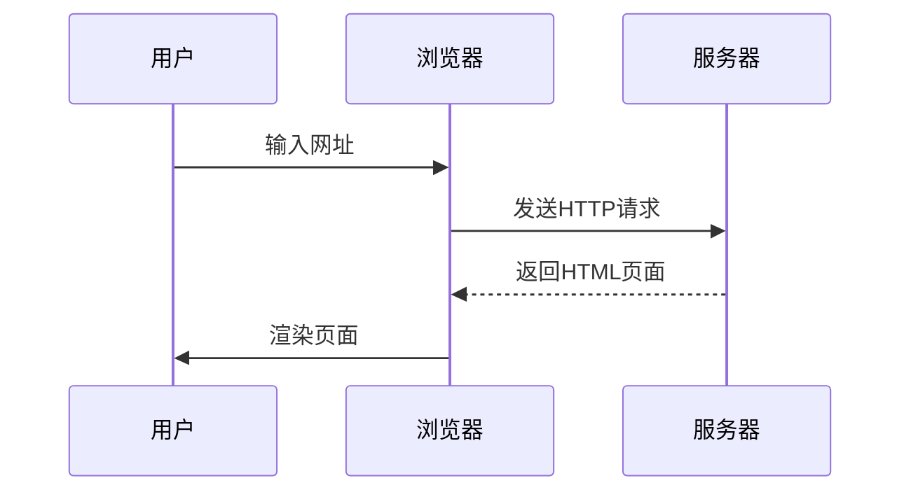
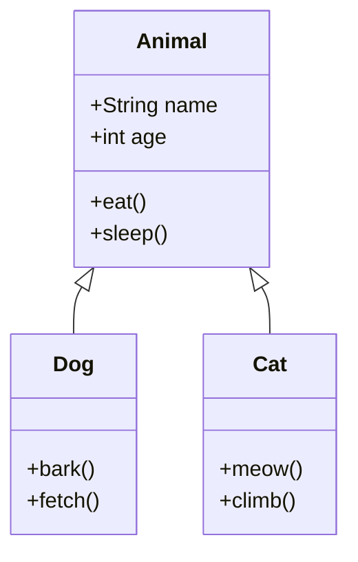
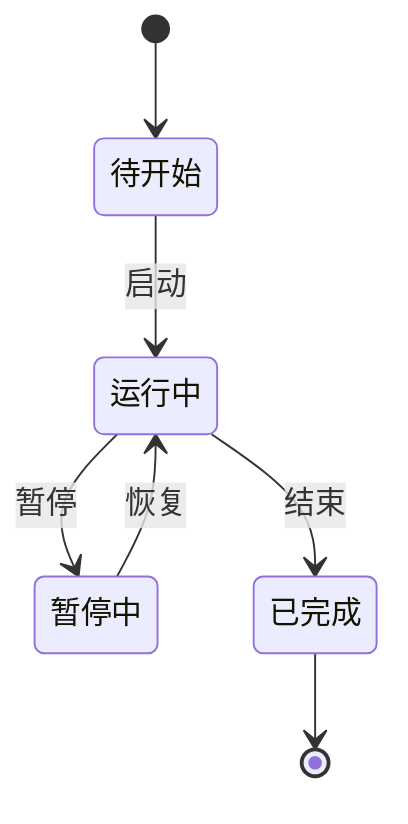
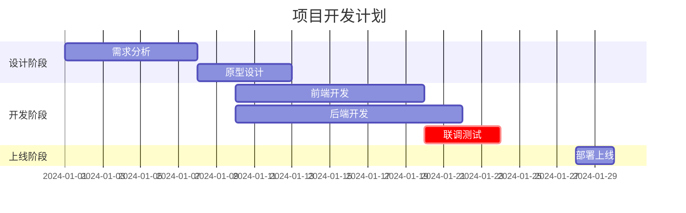

# Mermaid 图表测试

## 流程图 (Flowchart)

```mermaid
graph TD
    A[开始] --> B{是否通过测试？};
    B -->|是| C[生成报告];
    B -->|否| D[调试代码];
    D --> B;
    C --> E[结束];
```

## 时序图 (Sequence Diagram)

```mermaid
sequenceDiagram
    participant 用户
    participant 浏览器
    participant 服务器
    
    用户->>浏览器: 输入网址
    浏览器->>服务器: 发送HTTP请求
    服务器-->>浏览器: 返回HTML页面
    浏览器->>用户: 渲染页面
```

## 类图 (Class Diagram)

```mermaid
classDiagram
    class Animal {
        +String name
        +int age
        +eat()
        +sleep()
    }
    class Dog {
        +bark()
        +fetch()
    }
    class Cat {
        +meow()
        +climb()
    }
    Animal <|-- Dog
    Animal <|-- Cat
```

## 状态图 (State Diagram)

```mermaid
stateDiagram-v2
    [*] --> 待开始
    待开始 --> 运行中 : 启动
    运行中 --> 暂停中 : 暂停
    暂停中 --> 运行中 : 恢复
    运行中 --> 已完成 : 结束
    已完成 --> [*]
```

## 甘特图 (Gantt Chart)

```mermaid
gantt
    title 项目开发计划
    dateFormat  YYYY-MM-DD
    section 设计阶段
    需求分析    :a1, 2024-01-01, 7d
    原型设计    :a2, after a1, 5d
    section 开发阶段
    前端开发    :b1, 2024-01-10, 10d
    后端开发    :b2, 2024-01-10, 12d
    联调测试    :crit, after b1, 4d
    section 上线阶段
    部署上线    :2024-01-28, 2d
```