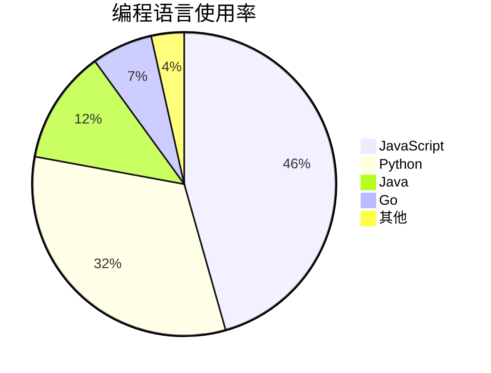

# 混合高级测试

## 嵌套列表与代码

1. 第一个步骤
   - 包含一个代码示例：
     ```bash
     echo "Hello from nested code"
     ls -la
     ```
   - 继续嵌套列表
     - 第三层
2. 第二个步骤

## 脚注示例

这里是一段需要脚注的文字[^1]。

这是另一个脚注引用[^note]。

[^1]: 这是脚注的具体内容，可以写较长说明。
[^note]: 命名式脚注。

## 定义列表 (非标准但常见)

术语一
: 这是术语一的定义。

术语二
: 这是术语二的定义，可以包含多行。
  第二行内容。

## HTML 原生元素

<div style={{ padding: '10px', background: '#f0f0f0', borderLeft: '4px solid #007acc' }}>
  <p>这是一个使用原生 <code>&lt;div&gt;</code> 和 <code>style</code> 属性的自定义块。</p>
  <p>可以用来模拟提示框或高亮区域。</p>
</div>

## 水平分隔线

上面
***
下面

## 转义字符测试

不转义：*星号*  
转义后：\*字面星号\*

不转义：# 一级标题  
转义后：\# 这不是标题

## 混合 Mermaid 与代码



> 此文件涵盖了定义列表、脚注、HTML块和转义字符，适合验证解析器的完整支持。